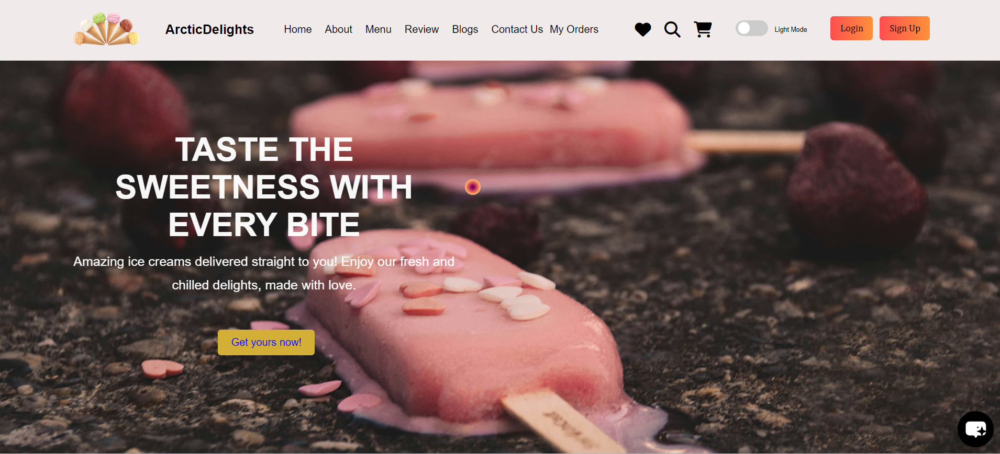
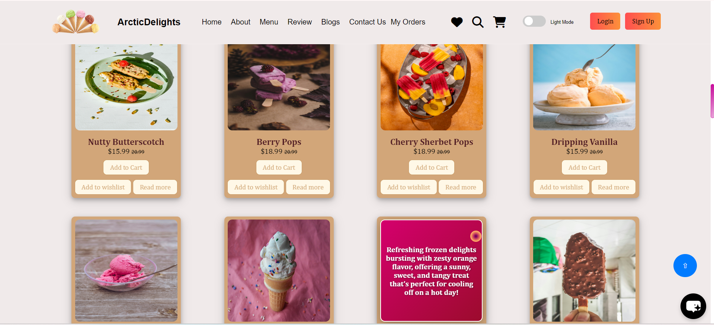
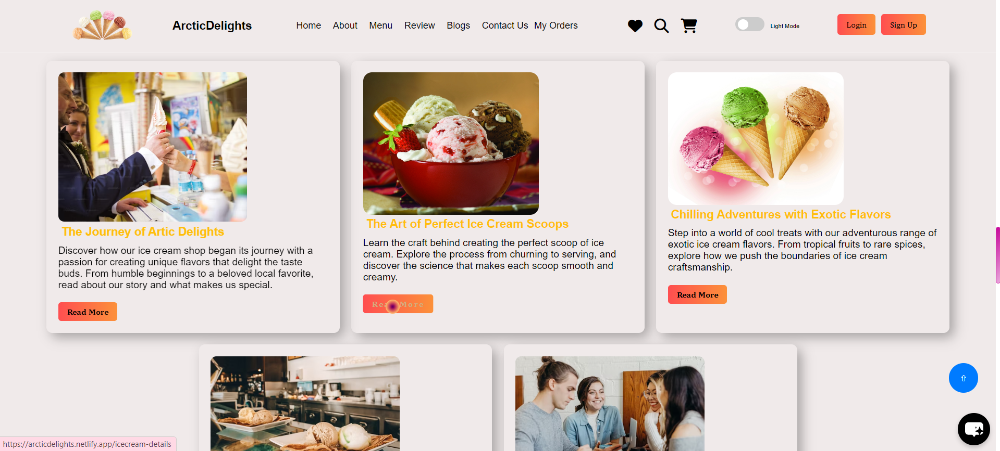

# 🍦 **Arctic Delights** 🍨  
Welcome to **Arctic Delights**! A visually stunning, beginner-friendly ice cream website designed to showcase the art of web development through a fun and delicious medium. Whether you're exploring flavors or admiring the responsive layout, this project is a sweet introduction to HTML, CSS, and JavaScript.

<div align = "center">
<br>

<table align="center">
    <thead align="center">
        <tr border: 1px;>
            <td><b>🌟 Stars</b></td>
            <td><b>🍴 Forks</b></td>
            <td><b>🐛 Issues</b></td>
            <td><b>🔔 Open PRs</b></td>
            <td><b>🔕 Close PRs</b></td>
            <td><b>🛠️ Languages</b></td>
            <td><b>🌐 Contributors </b></td>
        </tr>
     </thead>
    <tbody>
         <tr>
            <td></td>
            <td></td>
            <td></td>
            <td></td>
           <td></td>
           <td></td>
           <td></td>
        </tr>
    </tbody>
</table>
</div>
<br>

## 🚀Featured In

<table>

   <tr>
      <th>Event Logo</th>
      <th>Event Name</th>
      <th>Event Description</th>
   </tr>
   <tr>
      <td></td>
      <td>GirlScript Summer of Code 2024</td>
      <td>GirlScript Summer of Code is a three-month-long Open Source Program conducted every summer by GirlScript Foundation. It is an initiative to bring more beginners to Open-Source Software Development.</td>
   </tr>
    <tr>
      <td></td>
      <td>Hacktoberfest 2024</td>
      <td>Hacktoberfest is a month-long celebration of open source software run by DigitalOcean, GitHub, and Twilio. It encourages contributions to open source projects and promotes a global community of developers.</td>
   </tr>

</table>
<br>

## 📚 Table of Contents

1. [Features](#-features)
2. [Technologies Used](#-technologies-used)
3. [Website](#-live-demo)
4. [Installation](#️-installation)
5. [Website Preview](#-website-preview)
6. [Contributing](#-contributing)
7. [Contributors](#our-valuable-contributors-️)
8. [Stargazers](#stargazers)
9. [Forkers](#forkers)
10. [Website Preview](#website-preview)
11. [Code of Conduct](#code-of-conduct)

## ✨ **Features**
- 🍧 **Beautiful Design**: A minimalistic yet attractive user interface that invites visitors to explore a wide range of delectable ice cream flavors, complete with vibrant imagery.
  
- 📱 **Responsive Layout**: Fully optimized for a smooth user experience across various devices, including mobile, tablet, and desktop.
  
- 🍨 **Flavors Section**: Highlights the most popular and mouthwatering ice cream flavors, from classic vanilla to exotic berry sorbet.
  
- 🛒 **Order Option (Future)**: The website is designed to include an "Order Now" option, letting users easily browse and order their favorite flavors in the future.

## 💻 **Technologies Used**
- 🌐 **HTML**: Structures the website, ensuring a solid foundation for its content.
  
- 🎨 **CSS**: Adds the magic of colors, fonts, and layout, making the website visually appealing.
  
- ⚙️ **JavaScript**: Adds interactivity, giving users a dynamic experience while browsing flavors.

## 🚀 **Live Demo**
Explore the live demo here and get a taste of Arctic Delights:  
🔗 [Live Demo](https://arcticdelights.netlify.app/)

## 🛠️ **Installation**

To experience Arctic Delights on your local machine, follow these steps:

1. ```bash
   git clone https://github.com/dohinaf/basic-icecream-website.git
   ```

2. After cloning, simply open the `index.html` file in your browser to view the site.

## 🤝 **Contributing**

We welcome all contributions that can help make Arctic Delights even better! Fork this repository, make your improvements, and submit a pull request.  We're excited to see your ideas come to life!

For guidelines refer [Contribution](Contributors.md) !!

## Our Valuable Contributors ❤️✨

[](https://github.com/dohinaf/basic-icecream-website/graphs/contributors)


## Stargazers

<div align='center'>

[](https://github.com/dohinaf/basic-icecream-website/stargazers)

</div>

## Forkers
<div align='center'>

[](https://github.com/dohinaf/basic-icecream-website/network/members)

</div>

<div align="center">
    <a href="#top">
        
    </a>
</div>

## Website Preview




## Code of Conduct
We are committed to fostering a welcoming and inclusive environment for everyone. All contributors and participants are expected to uphold the following values:

- Be respectful of different viewpoints and experiences.
- Show empathy toward others.
- Use inclusive language.

Please read and follow our [Code of Conduct](Code_of_Conduct.md) to foster an inclusive community.
If anyone violates these standards, they may be banned from the community.

# Thanks for reading!!!